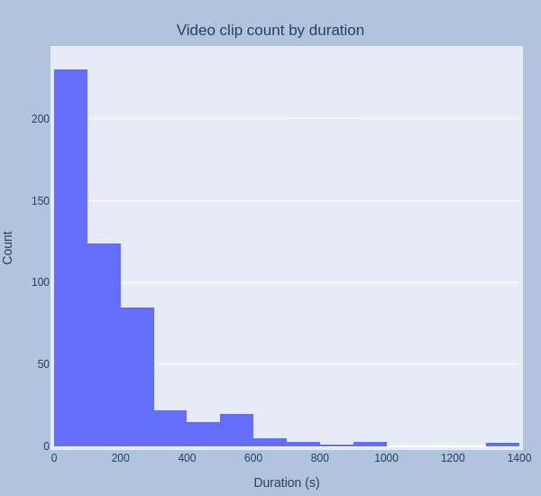
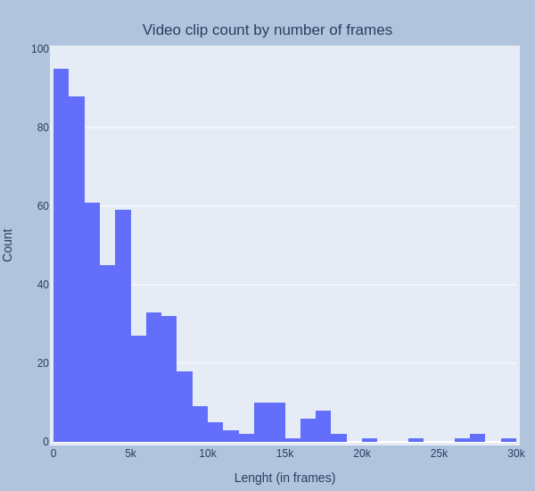

# MPEG-7 Video Signature vulnerability analysis 

After the findings of the previous milestone, in this episode we would like to extend further our understanding of the MPEG-7 video signature by analyzing its application over the described VCBD dataset. 
It is worth noting that such dataset **only contains positive pairs**, i.e. actual instances of duplicate clip "attacks".
For this milestone, we have extracted in a binary format all the 528 signatures of the videos provided in the VCDB dataset. 
From these, we have evaluated the performance of both the coarse part (45-frame segment aggregators) as well and the fine part (frame-by-frame descriptors) against a set of eight standard sequence similarity indexes (jaccard, jaro, cosine, levenshtein, tanimoto, bag, tversky and hamming). 
Moreover, we have also vectorized both versions of the signatures (coarse and fine) by means of a term frequency-based feature hashing.
With all the four versions of the signatures, we have computed all the distances both in the pairings proposed by the VCDB dataset annotations (**True Positive Detections**) as well as in a random pairing sequence with only non-duplicates (**True Negative Detections**).
Although the produced charts do not permit to conclude on specific thresholds for any of the signature formats / indexes, we can see some patterns like an increase in the correlation for the **True Positive Detections** set when compared to the **True Negative Detection**, or even some shy clusters popping up. This gives us good hopes on the applicability of the MPEG-7 signature as a source of information for Near Duplicate Video Detection.

## Visualizing the signature

As described [above](https://forum.livepeer.org/t/near-duplicate-video-detection-video-based-fraud-detector/1958#signature-extraction-and-compression-5), the MPEG-7 signature is extracted frame by frame from a given video asset. 
During extraction time four levels of signature are built: three per frame referred in the documentation as **fine signature**, **words**, and **confidence** and another at the segment level named **coarse signature**. 
The actual **fine-signature** of each frame is arranged as chunks of 76 integer digits representing specific "elements", whereas the **words** descriptor is an array of 5 integers representing luminance "words" of the frame, and the **confidence** value is a single integer representing a frame's median value of the previous "elements".
Regarding the **coarse signature**, it can be seen as a 155 digit vector aggregating the luminance characteristics of sets of 90 frames in a per-segment fashion. Levels are defined arbitrarily in the standard at 90 frames, overlapped 45, and does not depend on the actual framerate of the clip.
A detailed description on how this aggregations happen can be found [here](https://ieeexplore.ieee.org/document/6164253) and [here](https://github.com/FFmpeg/FFmpeg/blob/master/libavfilter/vf_signature.c). 
**Note:** We found a slight disonance between FFmpeg's implementation and the description in the article, as the fine signature seems to be defined with a 380 elements, whereas we could only extract the binary data using a 76 integer array (=380/5).

Once extraction is complete, FFmpeg's implementation allows one to have it stored in binary or XML format. We already showed how the binary files' size grows linearly with the number of encoded frames, whereas the XML gives place to humungous versions of the same information that renders it fairly useless for our purposes.

The charts below illustrate the shape of the four levels of detail available when extracted from one of the clips (this one belonging to the *bolt_beijing_100m* topic of the VCDB dataset).

**Confidence** level, is a single integer for each frame in the sequence:

**Words** level, a 5 x Nframes matrix that can also be represented as five separate time series:

**Fine signature** level, depicted as a 72 x Nframes grayscale image:

**Coarse signature** signal where the elements of the fine signature become summarized in a narrower 243 x Nsegments binary representation:

The extraction of the **fine signature** from the bitstream runs at an average ~900FPS, whereas the **coarse signature** can already be read at ~17600 FPS using the same python script mentioned above. This means a 22x faster perfomance, with a size in memory also ~22x smaller, making it very interesting for fast detection processes. The other two frame level signals, with even less computational, load can be also utilized for fast matching in a prior stage.

# Signature extraction over the dataset

As described in the corresponding VCDB article [here](https://fvl.fudan.edu.cn/dataset/vcdb/list.htm), the dataset we are using is built from 28 queries to YouTube and MetaCafe. We will refer to them as *topics*. Out of these 28 queries, 528 video clips were selected and the matching of segments within each other was annotated manually and shared with the scientific community.
Now that we have a better understanding of the architecture of the MPEG-7 signature, we are in a position of analyzing a bit deeper the characteristics of the generated sequences out of those videos.
We retrieved the 528 signatures by means of the [FFmpeg signature filter](https://ffmpeg.org/ffmpeg-filters.html#toc-signature-1) to their binary format. The corresponding binaries are included in the associated repository under the *processed signatures* folder with .bin extension. The scripts used to extract them are also provided there.

As can be seen in the following histogram, the topics are not populated equally in number of clips:

Nor in the number of accumulated frames:

As mentioned earlier, the frame lenght impacts directly over the size of the signature. This should be taken into account not only for the computational costs that will be met when assessing different topics, but also at the time of evaluating the different matching accuracies.

According to the authors, the dataset contains mostly clips under 3 minutes (180s) and only a few (8.3%) have a longer duration.
This is reflected in the histogram below (in seconds):

However, the four levels of signature (confidence, words, fine and coarse) are generated on a per-frame basis. The histogram below shows the distribution of the 528 clips according to their lenght in frames, instead of seconds:

Finally, we can also analyze the distribution of the clips based on their framerate: 

## Signature resampling

From the charts above, the first thing that comes to mind when searching for matches is that in a number of cases signatures are based on sequences of frames sampled at different frame rates. 

This means that a resampling pre-processing is in order if we are to find matches in the respective signals. Otherwise any distance metric we may want to use will not be able to properly characterize the underlying patterns.
This can be better understood in the example below:

Here, the **confidence** signals of two randomly selected titles are compared. Not only they have different lenghts, but more importantly each one has originally a different framerate (25fps and 15fps, respectively). 

Only once they are both resampled to 30fps, the signals A and B are capable to depict with clarity the match between the segments 250-300 (in signal A) and 20-60 (in signal B). 

The red line represents the original development of signal A at 25fps. It shows clearly that any frame-to-frame pointwise comparison against signal B would be totally fruitless.

These considerations do not apply, however, to the **coarse** signature type of signals, as their construction relies on a fixed aggregation every 90 frames.

# Signature's Locality Sensitive Hashing (LSH)

In this milestone, for the sake of clarity, we will limit ourselves to the study of the **coarse** section of the signature. As explained above, its generation is well detailed in the [corresponding article](https://ieeexplore.ieee.org/document/6164253). Nevertheless we will quote here the relevant part:
> The bag-of-words representation is extracted for temporal segments of 90 consecutive frames. As seen earlier, each fine signature contains five words, i.e. five subsets of the complete frame signature. For each of these five words, the values that it takes over the 90 frame sequence are plotted into a 243-bin histogram [...]. 

> [...] Then, each histogram is binarized, by setting the value of each bin to 1 if it is greater than 0, and leaving as 0 otherwise. This gives rise to five binary occurrence histograms bk , k ∈{1,...,5} , which become the coarse segment signature b for the 90-frame segment. 

In other words, even though the size of the **coarse signature** grows with the amount of frames, it doesn't reflect the evolution in time of the frames' characteristics as a single value, but more as groups of histograms.
For a given set of signatures, this leaves us with sequences of variable lenght that need to be matched at specific points in their timelines and, if possible, with sublinear complexity: enter LSH.

[Locality Sensitive Hashing (LSH)](https://ojs.aaai.org/index.php/AAAI/article/view/9133/8992) is a fairly recent approach to similarity search with applications in NLP, image retrieval, basically, anything else that involves matching within large datasets (recommender systems, clustering, audio identification, ...) 

An excellent article describing the technique in context can be found [here](https://www.pinecone.io/learn/vector-indexes/), and more in detail [here](https://www.pinecone.io/learn/locality-sensitive-hashing/).
According to [this source](https://santhoshhari.github.io/Locality-Sensitive-Hashing/):
> LSH works on the principle that if there are two points in feature space closer to each other, they are very likely to have same hash (reduced representation of data). LSH primarily differs from conventional hashing (aka cryptographic) in the sense that cryptographic hashing tries to avoid collisions but LSH aims to maximize collisions for similar points. In cryptographic hashing a minor perturbation to the input can alter the hash significantly but in LSH, slight distortions would be ignored so that the main content can be identified easily. The hash collisions make it possible for similar items to have a high probability of having the same hash value.

We have tested the approach proposed in Pinecone's description and [provided code](https://github.com/pinecone-io/examples/blob/master/locality_sensitive_hashing_traditional/sparse_implementation.ipynb), including their excellent notebook into our repository under testing_lsh.ipynb.

The process implies roughly four steps:

1. Shingling and one-hot encoding
2. Minhashing to obtain a compacted non-sparse vector of fixed lenght
3. Banding and bucketing of the hash into the LSH Hash tables
4. Iterate step 3 to adjust for recall and precision

# A proposal NDVD workflow for the Livepeer ecosystem

For the problem of duplicate video detection, the overall workflow would be as follows:

- Extract the MPEG-7 signature  of current videos and store them in some form of database.
- Build the feature vectors of the different levels of signature (coarse, and fine) by means of MinHashing.
- Assemble LSH Hash tables for both fine and coarse levels taking into account our recall and precision needs to define the right number of tables and hash sizes.
- For newly transcoded videos, extract their feature vectors and query the coarse LSH tables.
- Compare the feature vector of the new item with the matches returned by means of the adequate distance metric (Jaccard, cosine, ...). 
- Run a one-to-one comparison in the time domain, searching for common patterns over signals resampled to the same framerate.
- Flag the new item as **copy** if there are overlapping frames over a given threshold.

# Conclusions and further work

In this second milestone we presented a more detailed view of the four elements of the MPEG-7 video descriptor (**coarse**, **confidence**, **words** and **fine** signatures). 

We also took a closer look at the characteristics of the VCDB dataset from the perspective of the use of the signatures computed in the previous milestone. It became clear that, in order to find matches of sub-segments it is necessary to apply a framerate resampling procedure in the fine signature level.

Finally, the Locality Sensitivity Hashing workflow was introduced as a means to build a sub-linear complexity system for duplicate search and flaging.

In the next milestone, we will aim at building  and evaluating a toy system for duplicate detection based on the VCDB dataset that improves over the one-to-one system, FFmpeg based, that we introduced in Milestone 1.

